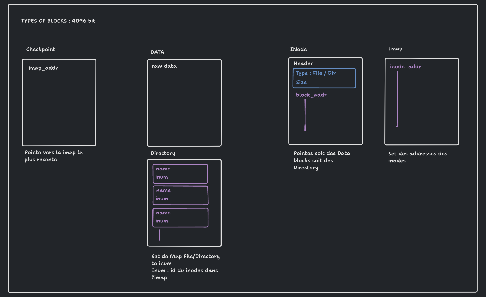
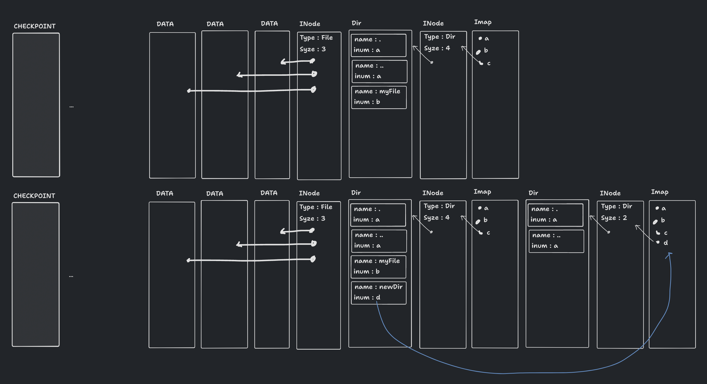

# Projet OS : Filesystems-distributed
# Rapport de projet
## Lucas TRAN

# Rappel des objectifs

Ce projet a pour ambition la mise en place d’un log-file-system distribué en partant d’un setup de communication UDP barebone. Il s'agit alors de mettre en place un protocole de communication entre le client et le serveur permettant au client de faire appel au fonction du file-system comme s’il s’agissait de sa machine : Remote Procedure Call (**RPC**).

Cette étape est cruciale pour le reste du projet. Mettre en place un RPC revient à un système de gestion d'entête de message pour savoir de quel type de requête doit être traité. On utilise alors une struct de message avec les différentes payloads et le type de requêtes dont le “type” sera un `enum`. On se retrouve avec pour chaque fonction de l’API dévoilé au client défini dans mfs.h une fonction sœur, utilisée par le serveur pour traiter les requêtes. Un switch statement dans `server.c` tel que : 
```C
// server.c
int rc = UDP_Read(sd, &addr, (char *)&message, sizeof(Message_t));
int res;
char answer[SERVER_BUFFER_SIZE];
switch (message.message_type)
{
case 0:
    res = MFS_Init_SERVER(sd, &addr);
    sprintf(answer, "%d", res);

    UDP_Write(sd, &addr, answer, SERVER_BUFFER_SIZE);
    break;
case 1:
    // LOOKUP
    res = MFS_Lookup_SERVER(message.pinum, message.name);
    sprintf(answer, "%d", res);
    UDP_Write(sd, &addr, answer, SERVER_BUFFER_SIZE);
    break;
// repeat for more request
```

On a alors : `MFS_Init`, `MFS_Lookup`... qui encapsule les requêtes UDP pour le client et `MFS_Init_SERVER`, `MFS_Lookup_SERVER`... se charge de l'implémentation sur le serveur des différentes fonctionnalités d'un Log File System.

Une fois cela fait, on pourra s’attaquer au Log File System. 

Tout d'abord, il faut initialiser le File System et écrire toutes les opérations sur un disk-image. On essaye alors d'intégrer au mieux un log **file** système même si on verra que certaines limitations ont été prises.


# Log File System

Un log file system fonctionne avec des blocs de taille constante (ici 4096 bit). Ces blocs peuvent avoir des fonctions différentes. Tout d'abord les Data block (les files) et les Directory block. Un file ou un dir peut cependant (souvent) être plus grand que simplement 4096 bit. 
On utilise alors des INode pour pointer plusieurs blocs pour un même file ou directory. Cet INode contient des metadata : le type de bloc vers qui il pointe et sa taille, c'est-à- dire le nombre de blocs vers qui il pointe. Suivi de ces metadata est une suite de pointeurs vers des data blocks (14 maximum ici). Pour un fichier dont 14 data block ne suffirait pas, il pourrait y avoir un mécanisme de Inode qui pointe vers d'autres Inodes mais cette fonctionnalité n'a pas été implémentée ici. 
Pour savoir où sont placés les différents inodes sur le disque, on utilise une IMap. Cette Imap est simplement une suite de pointeurs vers les INodes.

Le principe d'un log file system veut que l'on utilise le moins possible de `lseek` possible vers un point fixe du disque dur possible, c'est pourquoi on écrit toujours "au bout du disk". Dans ce principe, les blocs Inodes sont toujours écrits sur des nouveaux blocs (sauf une fois que l'on a fait le tour du disque mais ce n'est pas traitée dans le cadre de ce projet). La imap est également écrit à nouveaux sur un nouveau bloc à chaque update. Ce principe permet de limiter les `lseek` mais il faut tout de même suivre la position de l'Imap. On utilise alors un bloc fixe sur le disque Checkpoint qui pointe vers l'Imap. En principe l'update de ce checkpoint est fait périodiquement et non pas systématiquement à chaque changement du positionnement de l'imap pour limiter les `lseek`.


[](./Diagram_type.png)

# Fonctionnement


### Helpers
Un log file system fonctionnant avec des blocs de taille fixe, j'ai mis en place des helpers permettant de naviguer plus facilement sur le disque de block en block.

*Explication dans les commentaires*

```C
// on store en mémoire l'address de l'imap
// dans un premier temps grâce au checkpoint
// puis à chaque modification de son address on modifie la variable imap_addr
off_t imap_addr;

// on store en mémoire le file_offset
off_t curr_addr;
int curr_block;
off_t seek_next_block()
{
    return seek_block(curr_block + 1);
}

// va au bout du disk, a la imap
off_t seek_imap()
{
    return seek_block(addr_to_block(imap_addr));
}

int block_to_addr(int b)
{
    return b * MFS_BLOCK_SIZE;
}

int addr_to_block(int addr)
{
    int b = addr / MFS_BLOCK_SIZE;
    return b;
}

// wrapper for lseek 
off_t seek_block(int n)
{
    curr_block = n;
    return lseek(fd, block_to_addr(n), SEEK_SET);
}

// wrapper for write
ssize_t log_write(const void *buffer, enum SIZE_ENUM size)
{
    ssize_t s = write(fd, buffer, size);
    if (s == -1)
    {
        perror("Error writing file");
        return -1;
    }

    // cette operation de lseek ne demande pas de deplacement sur le disk et est donc instant
    // comme on connait size, on pourrait simplement faire :
    // curr_addr = curr_addr + size
    // mais j'ai prefere cette approche pour limiter les erreurs
    curr_addr = lseek(fd, 0, SEEK_CUR);
    curr_block = addr_to_block(curr_addr);
    return s;
}

// wrapper for read
ssize_t log_read(void *buffer, enum SIZE_ENUM size)
{
    ssize_t s = read(fd, buffer, size);
    if (s == -1)
    {
        perror("Error reading file");
        return -1;
    }

    // cette operation de lseek ne demande pas de deplacement sur le disk et est donc instant
    // comme on connait size, on pourrait simplement faire :
    // curr_addr = curr_addr + size
    // mais j'ai prefere cette approche pour limiter les erreurs
    curr_addr = lseek(fd, 0, SEEK_CUR);
    curr_block = addr_to_block(curr_addr);
    return s;
}
```

### MFS_CREAT
On s'attardera sur le fonctionnement de la fonction `MFS_Creat_SERVER` qui encadre bien la philosophie et le fonctionnement général du code.

```C
int MFS_Creat_SERVER(int pinum, int type, char *name)
```

La fonction a pour responsabilité de créer un nouveau fichier ou un nouveau dossier.

`pinum` correspond à l'INode du dossier parent (plus précisément, a l'id dans l'imap de l'INode du dossier parent). `type` a `MFS_DIRECTORY` (0) ou `MFS_REGULAR_FILE` (1). `name` au nom du nouveaux fichier/dossier.

```C
off_t parent_inode_addr = imap_cache[pinum];
if (pinum < 0 || parent_inode_addr == 0)
{
    perror("mfs_creat inode overflow");
    return -1;
}

seek_block(addr_to_block(parent_inode_addr));
MFS_Stat_t stat_buffer;
log_read(&stat_buffer, SIZE_INODE_H);

// 
// Error handle
//

// on a read le header de l'inode parent. On est donc bien positionné pour lire l'adresse du dossier.
off_t dir_addr;
log_read(&dir_addr, SIZE_ADDR);
seek_block(addr_to_block(dir_addr));
```

En premier lieu, on va vouloir chercher le dossier parent pour vérifier qu'il n'est pas plein.

```C
MFS_DirEnt_t dir_buffer;
int empty_place = 0;
for (int i = 0; i < SIZE_BLOCK / SIZE_DIR; i++)
{
    log_read(&dir_buffer, SIZE_DIR);

    if (strcmp(dir_buffer.name, name) == 0)
    {
        return 0;
    }
    if (strcmp(dir_buffer.name, "") == 0)
    {
        empty_place = 1;
        // on remonte l'aiguille
        lseek(fd, -SIZE_DIR, SEEK_CUR);

        MFS_DirEnt_t dir_content;
        checkpoint.inode_number++;
        strcpy(dir_content.name, name);
        dir_content.inum = checkpoint.inode_number;
        log_write(&dir_content, SIZE_DIR);
        break;
    }
}

if (empty_place == 0)
{
    perror("MFS_Creat il n'y a plus de place dans le dossier");
    return -1;
}
```

Ici, on lit chaque ligne du dossier. S'il existe déjà un fichier ou dossier au nom de `name`, on peut s'arrêter là (il n'y plus besoin de créer un nouveau fichier). On y cherche un emplacement vide pour y référencer l'inum du block que nous allons créer.
On ne gère pas le cas où le dossier est rempli et qu'il faudrait l'agrandir avec un nouveau bloc.

```C
// on remonte l'aiguille
lseek(fd, -SIZE_DIR, SEEK_CUR);
```
Cette ligne est intéressante. A chaque tour de boucle on `read` une name to inum map contenue dans le dossier. Cependant cette action décale le file_offset. Donc lorsque l'on `read` qu'il existe un espace libre, et que l'on veut y `write` la name to inum map, il faut revenir à l'emplacement de cet espace libre avec `lseek`.

On veut maintenant écrire le nouveau bloc. On se déplace donc au premier bloc vide.
```C
seek_imap(); // seek end of file
off_t inode_addr = seek_next_block();
```

Lorsque l'on veut écrire un nouveau fichier. On créera simplement un inode ne pointant vers aucun block data. En effet, il n'y a encore rien à écrire. `MFS_Creat` est alors un équivalent de `touch`.

On s'attardera au cas où l'on veut créer un nouveau dossier, c'est plus intéressant.

On crée un nouveau bloc dossier avec déjà deux entrées : `.` et `..`. L'inum du dossier root `.` est connu, c'est 0. L'inum du dossier parent `..` est spécifié lors de l'appel de `MFS_Creat`, c'est `pinum`.

```C
off_t block_addr = lseek(fd, 0, SEEK_CUR);
MFS_DirEnt_t root_dir;
strcpy(root_dir.name, ".");
root_dir.inum = 0;

log_write(&root_dir, SIZE_DIR);

strcpy(root_dir.name, "..");
root_dir.inum = pinum;
log_write(&root_dir, SIZE_DIR);
```

On crée maintenant l'INode. Pour cela on se place au prochain bloc avec `seek_next_block()`. On y écrit d'abord ses metadata puis l'adresse du dossier.

```C
inode_addr = seek_next_block();
// Header
MFS_Stat_t inode;
inode.type = 0; // dir
inode.size = 2; // il y a rien dedans pour l'instant
log_write(&inode, SIZE_INODE_H);
log_write(&block_addr, SIZE_ADDR);
```

On va maintenant pouvoir créer une nouvelle imap.

```C
imap_cache[checkpoint.inode_number] = inode_addr;
imap_addr = seek_next_block();
log_write(&imap_cache, SIZE_BLOCK);
```

Ici on updatera aussi checkpoint directement même si cela va à l'encontre du principe du Log File System qui voudrait limiter ce genre d'opération (`lseek` a un point fixe du disque dure).

```C
checkpoint.imaps_addr = imap_addr;

// on pourrait aussi n'update checkpoint que lorsqu'on MFS_SHUTDOWN
// on devrait update checkpoint périodiquement mais bon c'est pas pour tout de suite
seek_block(0);
write(fd, &checkpoint, sizeof(Checkpoint_t));
```

Voici une version illustrer :

[](./MFS_CREAT.png)

# Test et état du code

Les tests ont dans la grande majorité fait en appelant dans le client de manière successive les fonctions de l'api mis en place et des prints.

Pour parler plus en détails des fonctionnalités manquante :
- Mise en place d'un buffer lors de l'écriture des blocs. Cela permet de pouvoir écrire à la suite plusieur Data block suivit d'un seul inode et une nouvelle imap.
- Mise en place d'une update périodique du checkpoint et non systématique.
- Fichier et dossier plus qu'une seule Inode. C'est à dire qu'un fichier peut avoir plus que 14 Data block, et n'est pas limité en taille.
- Gestion de plusieurs Imap en même temps. Pour le moment, il n'y a qu'une seule imap, et on est limité aussi dans le nombre de inode en vie
- Garbage collector : gestion des blocs "mort", c'est-à- dire qui ne sont plus référencés nulle part.
- Que se passe-t-il lorsque l'on arrive au bout du disque et qu'on commence a être dans une situation où l'on écrit par dessus des blocs mort.
- Mise en place d'argument lors de l'exécution de `./server & ./client` pour spécifier une image disque. Pour l'instant c'est une variable dans le code. Idem pour l'initialisation de l'image ou l'utilisation tel quel de l'image, il faut modifier `re_init_image_disk` soit `0` soit `1`.
- Il faudrait partitionner le code dans des fichiers et lib différentes pour plus de lisibilité. N'étant pas grand expert de la compilation en C, j'ai évité un maximum de complication à ce niveau la et j'ai donc tout écrit dans `mfs.c`.
